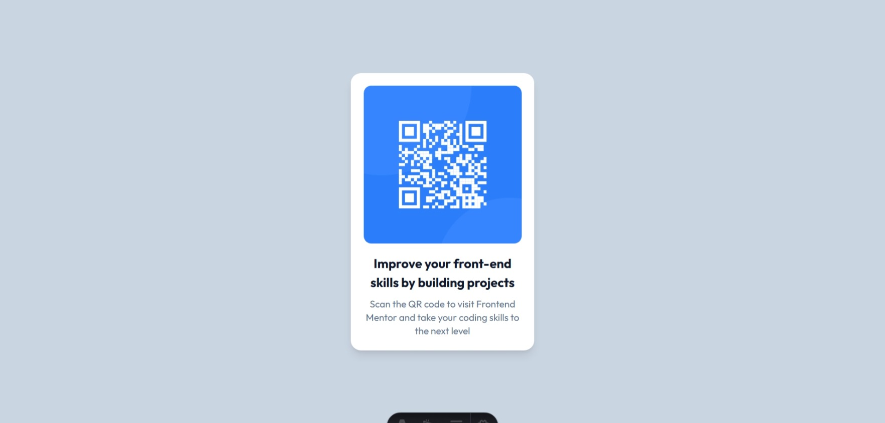

# 🧩 Proyecto: Componente QR Code

Este proyecto consiste en el desarrollo de un **componente de Código QR** utilizando **Astro** y **Tailwind CSS**.  
El objetivo es aplicar los conocimientos sobre **componentes**, **maquetación**, **estilos responsivos** y **utilidades CSS** para construir un diseño limpio, moderno y adaptable a diferentes dispositivos.

---

## 📖 Descripción general

### 🧩 Vista previa del proyecto

---

### 🔗 Enlaces del proyecto

- **Repositorio en GitHub:** https://github.com/anakgomez23-maker/QrCodeComponent
- **Sitio desplegado (opcional):** https://qr-code-component-gold-rho.vercel.app/

---

## 🧠 Proceso de desarrollo

### 🛠️ Tecnologías utilizadas
Las tecnologías utilizadas para desarrollar este proyecto fueron:

- Astro para la estructura del proyecto y el manejo de componentes.
- Tailwind CSS para aplicar estilos de forma rápida utilizando clases utilitarias.
- HTML5 semántico para estructurar correctamente el contenido.
- CSS responsive (Mobile-first) para adaptar el diseño a diferentes dispositivos.
- Componentes reutilizables para organizar mejor el código.

---

### 💡 Lo que aprendí
Aprendí a utilizar Astro para estructurar un proyecto basado en componentes, lo cual permite mantener el código más organizado y reutilizable. También reforcé el uso de Tailwind CSS, que facilita aplicar estilos de manera rápida sin escribir mucho CSS personalizado.

---

### 🚀 Áreas de mejora

Aunque el proyecto funciona correctamente, hay algunos aspectos que puedo mejorar en futuros proyectos:

- Mejorar aún más el manejo del responsive para diferentes tamaños de pantalla.
- Organizar mejor la estructura de componentes dentro del proyecto Astro.
- Aprender a utilizar variables personalizadas de Tailwind para mantener estilos más consistentes.
- Implementar animaciones o transiciones suaves para mejorar la experiencia visual.

---

### 📚 Recursos útiles

Durante el desarrollo del proyecto utilicé principalmente la documentación oficial y algunos recursos en línea para resolver dudas sobre la estructura y los estilos.

- Documentación de Astro
https://docs.astro.build
- Documentación de Tailwind CSS
https://tailwindcss.com/docs

---

### 👩‍💻 Autor

- **Nombre completo:**  Ana Karen Tovar Gomez
- **Carrera:**  ING. TICS
- **Grupo:**  11:00-12:00 
- **Correo institucional:**  23151205@aguascalientes.tecnm.mx

---

### ✨ Reflexión final

- ¿Qué fue lo más fácil o lo más difícil de realizar?  
Lo más fácil fue aplicar los estilos utilizando Tailwind CSS, ya que permite diseñar rápidamente usando clases utilitarias. Lo más difícil fue familiarizarme con la estructura del proyecto en Astro y entender cómo organizar correctamente los archivos y componentes.
- ¿Qué parte disfrutaste más del desarrollo?  
La parte que más disfruté fue la creación del diseño de la tarjeta del código QR, ya que pude ver cómo el diseño iba tomando forma poco a poco utilizando Tailwind y logrando que el componente se viera limpio y centrado.
- ¿Qué conceptos nuevos aprendiste?  
Aprendí a trabajar con Astro para crear componentes, a utilizar Tailwind CSS para aplicar estilos de manera rápida, y también tuve que familiarizarme con el lenguaje y la estructura del proyecto, ya que era la primera vez que trabajaba con estas herramientas en conjunto.
- ¿Cómo aplicarías lo aprendido en proyectos futuros?
Podría aplicar lo aprendido para crear interfaces más organizadas y responsivas, utilizar componentes reutilizables, y mejorar la estructura de mis proyectos para que el código sea más limpio y fácil de mantener.